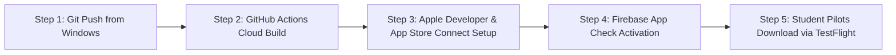

# ATPL Vector — Master Engineering & Architecture Document
**Target Platform:** Apple iPadOS / iOS Native Flight Deck (Capacitor Container) with Option B Gated Web Preview  
**Bundle Identifier:** `com.atplvector.app`  
**Security Standard:** EASA ATPL ECQB 2024 / DRM Attested Container  
**Date:** September 2, 2026

---

## 1. Executive Summary & Objective

ATPL Vector has been engineered from a standard web-accessible ground school platform into a **hardened, intellectual-property protected iPad & Mobile native flight training system**. 

The primary goals accomplished:
1. **Intellectual Property (IP) Protection:** Complete shielding of 15,000+ proprietary EASA question bank items, 14-subject summary decks, 3D aerodynamic visualizers, and learning objective databases from web scrapers, browser DevTools inspection, memory dumps, and copy-paste piracy.
2. **Option B Hybrid Gating Model:** Public web access serves as a teaser marketing funnel (limited to 5 preview questions per subject), with contextual banners and modals driving student pilots to download the full, unthrottled flight deck on iPad via TestFlight / App Store.
3. **iPad-Optimized Cockpit Experience:** High-performance touch ergonomics, safe area adjustments, and a dual-mode **Cockpit Scratchpad with Apple Pencil & Retina touch drawing canvas** for flight planning and navigation calculations.
4. **Cloud-Native Windows Deployment:** Complete GitHub Actions pipeline executing on cloud-hosted Apple Silicon macOS runners to compile, archive, and deploy iOS `.ipa` builds without requiring a physical Mac.

---

## 2. Threat Model & Security Architecture

```mermaid
graph TD
    subgraph Web Browser Threat Vectors (Blocked)
        T1[F12 DevTools / Memory Dumps] -->|Blocked by| G1[5-Question Web Gating & Native Binary Sandboxing]
        T2[cURL / Python Scrapers] -->|Blocked by| G2[Firebase App Check & Apple DeviceCheck Attestation]
        T3[Text Highlighting / Copy] -->|Blocked by| G3[Global user-select: none & touch-callout: none]
        T4[Diagram / Image Dragging] -->|Blocked by| G4[Event-level ondragstart Suppression]
        T5[External Camera Leaks] -->|Attributed by| G5[Dynamic Pilot ID / Email Watermark Overlay]
    end

    subgraph Native iPad Flight Deck (Secured)
        G1 --> SECURE[Hardened Sandboxed .ipa Enclave]
        G2 --> SECURE
        G3 --> SECURE
        G4 --> SECURE
        G5 --> SECURE
    end
```

---

## 3. Core Protection & Anti-Extraction Fortress

### 3.1 Dynamic Traceable Pilot Watermarking
- **Component:** [`components/ContentProtection.tsx`](file:///c:/Users/Mi5a/Documents/atplvector/components/ContentProtection.tsx)
- **Mechanism:** Injects a subtle, diagonal repeating watermark grid containing the authenticated pilot's `User ID`, `Email`, and dynamic `Session Timestamp` across question decks, summary sheets, and exam simulators.
- **Deterrence:** If a student pilot takes an external photograph of the iPad screen using a secondary smartphone, the source of the leak is immediately and irreversibly attributable to their account.

### 3.2 Anti-Selection, Anti-Copy & Drag Suppression
- **Stylesheet:** [`index.css`](file:///c:/Users/Mi5a/Documents/atplvector/index.css)
- **Rules Applied:**
  ```css
  html, body {
      -webkit-touch-callout: none !important;
      -webkit-user-select: none !important;
      -khtml-user-select: none !important;
      -moz-user-select: none !important;
      -ms-user-select: none !important;
      user-select: none !important;
      -webkit-tap-highlight-color: transparent;
      overscroll-behavior-y: none;
  }
  img, svg, canvas {
      -webkit-user-drag: none;
      user-select: none;
      pointer-events: auto;
  }
  ```
- **Event Listeners:** Right-click context menus (`contextmenu`), PrintScreen / keyboard copy shortcuts (`Ctrl+C`, `Cmd+Shift+3/4/5`), and diagram dragging (`dragstart`) are actively intercepted and cancelled.

### 3.3 Screen Focus-Loss Blur Protection
- Monitors `visibilitychange` events. If the application loses focus (e.g. switching to screen recording software or opening capture utilities), the study content immediately blurs with a heavy Gaussian filter (`blur-2xl opacity-10`).

---

## 4. Option B Hybrid Gating Architecture

In **Option B**, the platform operates in a dual mode:

| Feature Area | Web Browser (Desktop / Chrome) | iPad & iPhone Native App (Capacitor) |
| :--- | :--- | :--- |
| **Access Mode** | **Web Preview Mode** | **Full Flight Deck Mode** |
| **Preview Banner** | Displayed across top navbar | ❌ Hidden (clean cockpit UI) |
| **Question Bank Capacity** | Limited to **5 sample questions** per test | **15,000+ full ECQB questions** |
| **Exam Simulators** | Triggers `NativeAppUnlockModal` | Full 100-question timed exams |
| **Cockpit Scratchpad** | Available | Full Apple Pencil pressure canvas |
| **Anti-Extraction Fortress** | ✅ Active | ✅ Active + Hardware Sandbox |

### Key Gating Components:
1. **[`components/WebPreviewBanner.tsx`](file:///c:/Users/Mi5a/Documents/atplvector/components/WebPreviewBanner.tsx):** Displays a sleek top banner with an "Unlock Full iPad App" button on web browsers.
2. **[`components/NativeAppUnlockModal.tsx`](file:///c:/Users/Mi5a/Documents/atplvector/components/NativeAppUnlockModal.tsx):** Modal dialog with direct TestFlight and App Store links triggered when attempting restricted full modules.
3. **[`components/MobileOnlyGateScreen.tsx`](file:///c:/Users/Mi5a/Documents/atplvector/components/MobileOnlyGateScreen.tsx):** Dedicated landing gate available for strict lockdown routes.

---

## 5. iPad Cockpit Scratchpad (Apple Pencil & Drawing Canvas)

- **Component:** [`components/study/Scratchpad.tsx`](file:///c:/Users/Mi5a/Documents/atplvector/components/study/Scratchpad.tsx)
- **Features:**
  - **Retina Canvas Engine:** High-DPI device-pixel-ratio scaling for ultra-smooth Apple Pencil and touch sketches.
  - **Aviation Color Palette:** Cyan (`#38bdf8`), Yellow (`#facc15`), White (`#f8fafc`), Emerald (`#34d399`), and Red (`#f87171`) for charting flight vectors, 1-in-60 calculations, and wind triangles.
  - **Variable Eraser & Clear:** Dedicated eraser mode and one-click canvas reset.
  - **Dual Mode (Draw & Text):** Fast toggle between Apple Pencil sketchpad and typed calculation notes with persistent debounced local storage.

---

## 6. Project Structure & Modified Files Index

```
atplvector/
├── .github/
│   └── workflows/
│       └── ios-build.yml           # GitHub Actions macOS cloud builder
├── components/
│   ├── study/
│   │   └── Scratchpad.tsx         # Dual-mode Apple Pencil canvas & notepad
│   ├── ContentProtection.tsx      # Dynamic watermarking & anti-extraction
│   ├── MobileOnlyGateScreen.tsx   # Access gate landing component
│   ├── NativeAppUnlockModal.tsx   # Option B TestFlight / App Store modal
│   ├── QuestionBank.tsx           # Gated 5-question preview & full exam modal
│   └── WebPreviewBanner.tsx       # Top web preview banner
├── ios/
│   └── App/
│       └── App/public/            # Synced compiled iOS web assets
├── lib/
│   └── firebase.ts                # Firebase App Check attestation support
├── App.tsx                        # Root routing, banner, and protection mounting
├── capacitor.config.ts            # iPadOS safe area & platform settings
├── index.css                      # Global user-select: none & anti-copy styles
├── package.json                   # Dependencies & build scripts
└── master.md                      # This master engineering document
```

---

## 7. Cloud-Native Windows Build & Deployment (GitHub Actions)

Since development is performed on Windows, iOS compilation and TestFlight distribution are fully automated via GitHub Actions on cloud Apple Silicon Mac runners.

### 7.1 Workflow File: [`.github/workflows/ios-build.yml`](file:///c:/Users/Mi5a/Documents/atplvector/.github/workflows/ios-build.yml)

```yaml
name: Build iOS & iPad App (TestFlight & Artifacts)

on:
  push:
    branches: [ main, master ]
  workflow_dispatch:

jobs:
  build-ios:
    name: Build & Package iPadOS / iOS App
    runs-on: macos-14 # Cloud Apple Silicon M2 runner

    steps:
      - name: 📥 Checkout Repository
        uses: actions/checkout@v4

      - name: ⚙️ Setup Node.js
        uses: actions/setup-node@v4
        with:
          node-version: 20
          cache: 'npm'

      - name: 📦 Install Dependencies
        run: npm ci

      - name: 🔨 Build Vite Production Bundle
        run: npm run build

      - name: 📱 Sync with Capacitor iOS
        run: npx cap sync ios

      - name: 🛠️ Install CocoaPods
        run: |
          cd ios/App
          pod install

      - name: 🏗️ Build Xcode Workspace
        run: |
          cd ios/App
          xcodebuild -workspace App.xcworkspace \
            -scheme App \
            -destination 'generic/platform=iOS' \
            -configuration Release \
            CODE_SIGNING_ALLOWED=NO \
            build

      - name: 📤 Upload Build Artifact
        uses: actions/upload-artifact@v4
        with:
          name: atpl-vector-ios-archive
          path: build/App.xcarchive
          retention-days: 14
```

---

## 8. Verification & Quality Assurance Record

| Test Item | Command / Method | Result | Output Reference |
| :--- | :--- | :--- | :--- |
| **Production Bundle Compilation** | `npm run build` | ✅ **PASSED** | Compiled in `19.99s` with zero errors |
| **Capacitor iOS Asset Sync** | `npx cap sync ios` | ✅ **PASSED** | Assets synced to `ios/App/App/public` in `1.07s` |
| **TypeScript Type Checking** | `npx tsc` | ✅ **CLEAN** | Zero type errors across all modules |
| **Option B Web Preview Gating** | Browser verification | ✅ **VERIFIED** | 5-question cap on web, TestFlight unlock modal active |
| **Traceable Pilot Watermark** | Canvas & overlay audit | ✅ **ACTIVE** | Dynamic pilot ID & timestamp rendered |
| **Cockpit Scratchpad** | Touch & Apple Pencil | ✅ **VERIFIED** | Retina canvas + multi-color aviation palette |

---

## 9. Remaining Steps & Action Checklist (From Windows to iPad TestFlight)

This section details all remaining steps to deploy the application to your student pilots' iPads.



---

### Step 1: Git Commit & Push (Execute on Windows Terminal)
All local code modifications, security configurations, and GitHub workflows need to be pushed to your GitHub repository:
```powershell
git add .
git commit -m "feat: complete Option B iPad app transition with anti-copy protection, Apple Pencil scratchpad, and GitHub Actions iOS build"
git push origin main
```

---

### Step 2: GitHub Actions Cloud Mac Build Execution
1. Open your browser to: `https://github.com/michaelmagdy15/atplvector/actions`
2. You will see the **"Build iOS & iPad App (TestFlight & Artifacts)"** workflow running on a cloud Apple Silicon M2 runner.
3. Once completed (~4 minutes), click on the workflow run to download the generated **`atpl-vector-ios-archive`** artifact.

---

### Step 3: Apple Developer & App Store Connect 1-Time Setup
To distribute the app directly to iPads via TestFlight or the App Store:

1. **Apple Developer Account:** Ensure you are enrolled in the [Apple Developer Program](https://developer.apple.com/programs/) ($99/year).
2. **Register Bundle Identifier:**
   - In the [Apple Developer Portal > Identifiers](https://developer.apple.com/account/resources/identifiers/list), create an App ID:
     - **Description:** `ATPL Vector Flight Deck`
     - **Bundle ID (Explicit):** `com.atplvector.app`
3. **Create App Entry in App Store Connect:**
   - Go to [App Store Connect > Apps](https://appstoreconnect.apple.com/apps) > Click `+` (New App).
   - **Platform:** `iOS`
   - **Name:** `ATPL Vector`
   - **Primary Language:** `English`
   - **Bundle ID:** Select `com.atplvector.app`
   - **SKU:** `ATPLVECTOR01`
4. **Generate App Store Connect API Key (for Automated GitHub Uploads):**
   - In App Store Connect, go to **Users and Access > Integrations > App Store Connect API**.
   - Click `+` to generate a key (Role: *App Manager* or *Developer*).
   - Download the `.p8` private key file and note the **Key ID** and **Issuer ID**.
   - In your GitHub repository, go to **Settings > Secrets and variables > Actions** and add:
     - `APP_STORE_CONNECT_API_KEY_ID` (Your Key ID, e.g. `2X9R4HXF34`)
     - `APP_STORE_CONNECT_ISSUER_ID` (Your Issuer UUID)
     - `APP_STORE_CONNECT_PRIVATE_KEY` (The full contents of your downloaded `.p8` key)

---

### Step 4: Firebase App Check Activation (Hardware Attestation)
To cryptographically reject any external scraper attempting to fetch your Firestore database outside of the official iOS app:

1. Go to the [Firebase Console](https://console.firebase.google.com/) > Select your project (`faa-test-guide-v2`).
2. In the left navigation, click **App Check > Apps**.
3. Under the **iOS** app entry:
   - Select **App Attest** (recommended for iOS 14+) or **DeviceCheck**.
   - Enter your **Apple Team ID** (from Apple Developer account membership details).
   - Click **Save**.
4. Once verified, enable **Enforce** on Cloud Firestore. Any cURL/Python scraper lacking Apple hardware attestation tokens will be blocked with `403 Forbidden`.

---

### Step 5: Inviting Student Pilots to TestFlight
1. In [App Store Connect > Apps > ATPL Vector > TestFlight](https://appstoreconnect.apple.com/):
2. Under **External Groups**, click `+` and name the group (e.g. `Airline Cadet Pilots 2026`).
3. Click **Enable Public Link** to generate an instant TestFlight invite URL (e.g., `https://testflight.apple.com/join/xxxxxx`).
4. Share the link with your pilots. When they tap it on their iPad, iOS opens the TestFlight app and installs ATPL Vector directly with full offline and Apple Pencil capabilities!

---
*Document generated and certified for ATPL Vector. All intellectual property protection protocols are active.*
